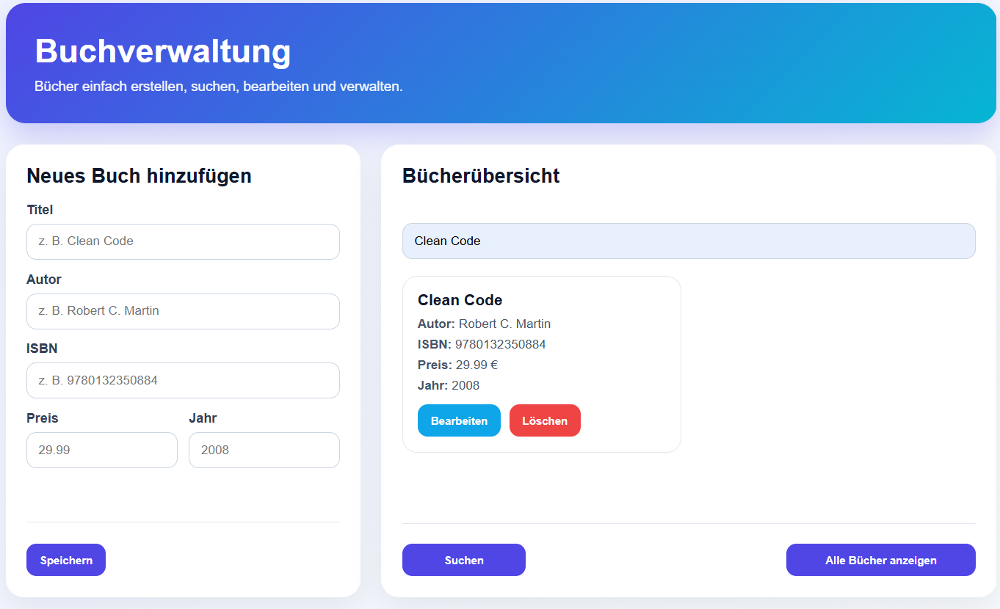

## 📘 Buchverwaltung – Spring Boot & MySQL
Ein vollständiges CRUD‑Backend zur Verwaltung von Büchern, entwickelt mit Java, Spring Boot, MySQL und MVC‑Architektur.
Zusätzlich enthält das Projekt ein Frontend mit HTML, CSS und JavaScript für eine benutzerfreundliche Buchverwaltung.

**Dieses Projekt demonstriert  Backend‑Entwicklung mit** :

- DTO‑basierter Request/Response‑Struktur

- Globalem Exception Handling

- Validierung mit Jakarta Validation

- Sauberer Service‑ und Repository‑Schicht

- Custom Exceptions

- Moderne Java Records

- BigDecimal für präzise Preisberechnung

--------------------------------------------------------------------------

## 📸 dashboard

-------------------------------------------------------------------------


## 🚀 Features
- 📚 Bücher erstellen, lesen, aktualisieren und löschen (CRUD)

- 🔍 Suche nach ID
- 🔎 Suche nach Büchern (Titel und Autor)
- 🎨 Modernes responsives Frontend mit HTML, CSS und JavaScript 
- 📄 Pagination (maximal 6 Bücher pro Seite)
- ✏️ Bücher direkt im Frontend bearbeiten
- 🗑️ Bücher direkt im Frontend löschen
- 🔔 Benutzerfreundliche Erfolg- und Fehlermeldungen

- 🛡️ Validierung aller Eingaben (Titel, Autor, ISBN, Preis, Erscheinungsjahr)

- ❗ Custom Exceptions (z. B. Buch nicht gefunden, ISBN bereits vergeben)

- 🌐 REST‑API mit klaren JSON‑Responses

- 🧱 Saubere Schichtenarchitektur (Controller → Service → Repository → Entity)

- 🧪 DTO‑Mapping für saubere API‑Antworten

--------------------------------------------------------------------------

## 🛠️ Technologien

| Technologie        | Zweck                      |
|--------------------|----------------------------|
| Java 25            | Programmiersprache         |
| Spring Boot        | REST‑API Framework         |
| Spring Data JPA    | Datenbankzugriff           |
| MySQL              | Relationale Datenbank      |
| Jakarta Validation | Eingabevalidierung         |
| Maven              | Build‑ und Dependency‑Tool |
| HTML5              | Frontend-Struktur          |
| CSS                | UI-Design                  |
| JavaScript         | Dynamische Frontend-Logik  |


-----------------------------------------------------------------------------
## 📂 Projektstruktur


```text
Buchverwaltung
│
├── frontend
│   ├── images          → Screenshots / Frontend-Bilder
│   ├── index.html      → Benutzeroberfläche
│   ├── style.css       → Design und Layout
│   └── script.js       → Frontend-Logik und API-Kommunikation
│
├── src/main/java/com/example/fstprog
│   ├── controller      → REST-Endpoints
│   ├── dto
│   │   ├── request     → Eingabe-DTOs (mit Validation)
│   │   └── response    → Ausgabe-DTOs (API-Responses)
│   ├── entity          → JPA-Entities
│   ├── exception       → Custom Exceptions + Global Handler
│   ├── repository      → JPA-Repository Interfaces
│   ├── service         → Business-Logik
│   └── BuchverwaltungApplication.java
│
├── src/main/resources
│   └── application.properties → Datenbank- und JPA-Konfiguration
│
├── pom.xml             → Maven-Konfiguration
├── README.md           → Projektdokumentation

```
---------------------------------------------------------------------------
## 📡 API‑Endpoints

📘 Bücher abrufen

GET /api/books

🔍 Buch nach ID abrufen

GET /api/books/{id}

➕ Neues Buch erstellen

POST /api/books

Beispiel‑Request:

### 📌 Beispiel‑Request

```json
{
  "title": "Clean Code",
  "author": "Robert C. Martin",
  "isbn": "9780132350884",
  "price": 29.99,
  "publishedYear": 2008
}
```

✏️ Buch aktualisieren

PUT /api/books/{id}

🗑️ Buch löschen

DELETE /api/books/{id}

🔎 Bücher nach Titel oder Autor suchen

GET /api/books/suche?keyword=deinSuchbegriff

### 🔍 Beispiel: Suche

GET /api/books/suche?keyword=martin

Antwort:

```json

 {
  "id": 1,
  "title": "Clean Code",
  "author": "Robert C. Martin",
  "isbn": "9780132350884",
  "price": 29.99,
  "publishedYear": 2008
 }
```
-----------------------------------------------------------------------------
## 🧩 Validierung

Alle Eingaben werden automatisch geprüft:

- @NotBlank für Strings

- @Positive für Preis

- @Min / @Max für Erscheinungsjahr

- @NotNull für Pflichtfelder

Fehler werden als klare JSON‑Antwort zurückgegeben:

```json
{
  "status": 400,
  "error": "Validation Failed",
  "messages": {
    "author": "Autor darf nicht leer sein"
  }
}
```

-------------------------------------------------------------------------

## ❗ Fehlerbehandlung

Das Projekt enthält einen globalen Exception Handler:

- BookNotFoundException

- DuplicateIsbnException

- MethodArgumentNotValidException

- Fallback für unerwartete Fehler

Beispiel:

```json
{
  "status": 404,
  "error": "Not Found",
  "message": "Buch mit der ID 5 wurde nicht gefunden."
}
```

-----------------------------------------------------------------------------

## 🗄️ Datenbankkonfiguration
In application.properties:

spring.datasource.url=jdbc:mysql://localhost:3306/buchverwaltung

spring.datasource.username=deinUsername

spring.datasource.password=deinPasswort

spring.jpa.hibernate.ddl-auto=update
spring.jpa.show-sql=true


---------------------------------------------------------------------------------

## ▶️ Projekt starten

### Voraussetzungen
- Java installiert
- Maven installiert
- MySQL installiert und gestartet


### 1. MySQL starten
Stelle sicher, dass dein MySQL-Server läuft.

### 2. Datenbank anlegen
Führe in MySQL folgenden Befehl aus:

```sql
CREATE DATABASE buchverwaltung;
````


### 3. Anwendung starten

Im Projektordner folgenden Befehl ausführen : 
mvn spring-boot:run

### 4. API aufrufen
Nach dem Start ist die API unter folgender Adresse erreichbar:

http://localhost:8080/api/books

-----------------------------------------------------------------------------
## 👤 Autor
**Frank  Sosterne Teumawe**

B.Sc. Informatikstudent – Junior Backend Developer
 mit Fokus auf Java | Spring Boot | Datenbankmanagement

Weitere Tech: JavaScript , HTML , CSS , C , C++
